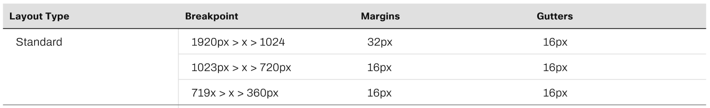

<h1 align="center">우리FISA - Frontend Toy Project</h1>

## Frontend-1st-Resume

## 👻 팀 소개
|  |  |  |  |
| ----------------------------------------------------------------------------------------------- | ----------------------------------------------------------------------------------------------- | ----------------------------------------------------------------------------------------------- | ----------------------------------------------------------------------------------------------- |
| [홍찬의](https://github.com/hcu55)                                                              | [황순범](https://github.com/HwangSunBeom)                                                            | [정성윤](https://github.com/apple6346654)                                                            | [이규한](https://github.com/kh-0818)                                                           |
| 팀장 프로젝트 관리                                                                    | 팀원 CSS                                               | 팀원 HTML                                          | 팀원 HTML                                                                     |
---

 

## 🎨 UI 스타일 가이드
### Figma의 [ConcreteDesign System](https://www.figma.com/community/file/1199986353366991625) 사용
- <h3>LayOut Grids 📏</h3>

     
    레이아웃은 Standard의 첫 번째 Gutters 16px ➡︎ 25%로 사용

- <h3>Typography 📝 - Display Text(Fluid 사용)</h3>

    

    - 글씨 크기에 따른 `FontSize` 조정
    - 글씨 크기에 따른 `Padding` 추가

- <h3>Font Color 🖍️ - 우리은행 CI 색상 사용</h3>

    
    제목 1 : BLACK (`000000`) 
    제목 2 : WOORI LIGHT BLUE (`20C4F4`) 
    제목 3 : WOORI DEEP BLUE (`0067AC`) 
    제목 4 : BLACK (`000000`)
    

- <h3>Image Size 🖼️</h3> 

    - 이미지 1 : `200px` x `150px`
    - 이미지 2 : `16px` x `40px`
    - 이미지 3 : 카드 크기의 `60%` x `100%` 

- <h3>Class Name Rule 📌</h3> 

    - 제목 1 : `text_xl`
    - 제목 2 : `text_l`
    - 제목 3 : `text_m`
    - 제목 4 : `text_s`
    - 이미지 1 : `img_profile` 
    - 이미지 2 : `img_tech`
    - 이미지 3 : `img_card`
    - background : `img_background`
    - 레이아웃 : `container`
    - 카드 : `container_card`
    - 컨텐츠 별 : `container_content`

- <h3>Branch Name Rule 🔃</h3> 

    - `main`
    - `dev`
    - `feature/{작업단위}`

- <h3>Commit Rule 🔃</h3> 

    - [Gitmoji](https://gitmoji.dev/) 사용 연습하기
    - 작업 내용 요약

## 🤖 Prototype
- Resume Main Page

    

- Project Page

    
