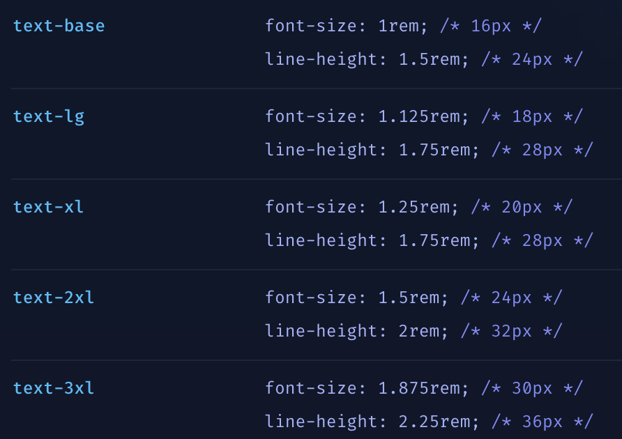
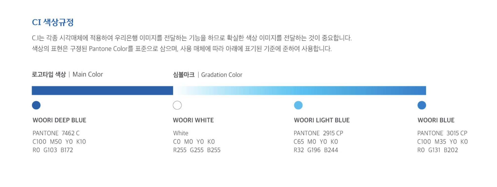
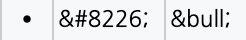
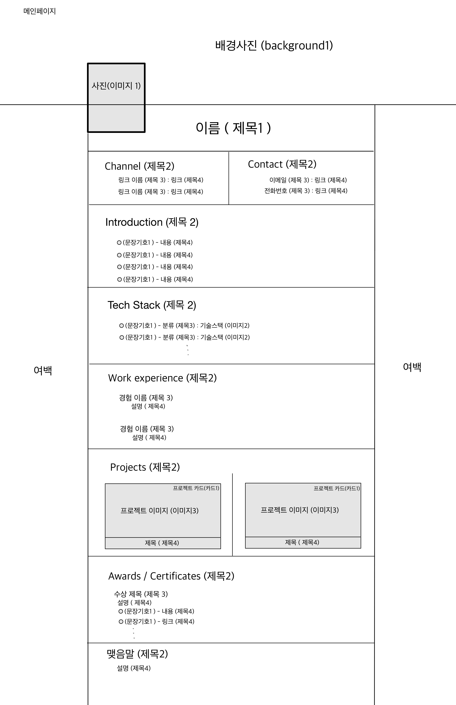
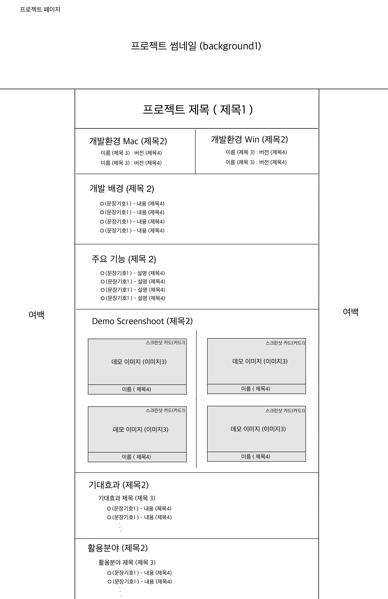
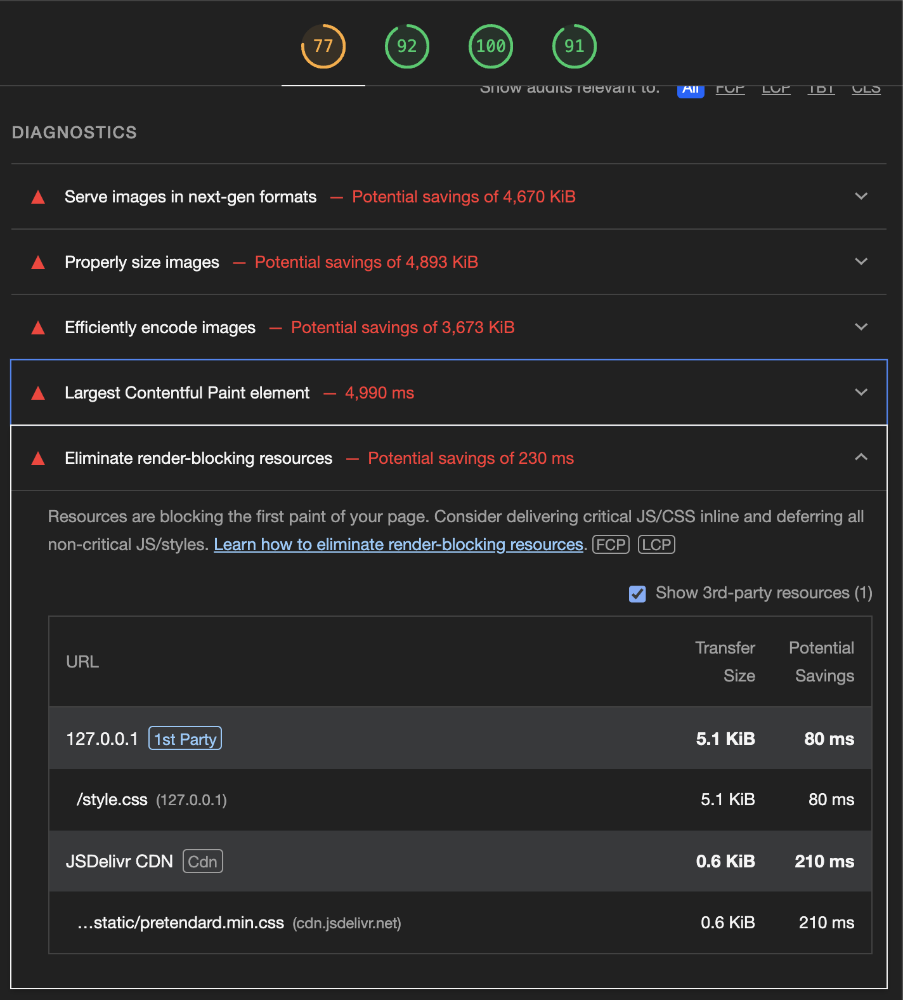

<h1 align="center">우리FISA - Frontend Toy Project</h1>

## Frontend-1st-Resume

## 👻 팀 소개
|  |  |  |  |
| ----------------------------------------------------------------------------------------------- | ----------------------------------------------------------------------------------------------- | ----------------------------------------------------------------------------------------------- | ----------------------------------------------------------------------------------------------- |
| [홍찬의](https://github.com/hcu55)                                                              | [황순범](https://github.com/HwangSunBeom)                                                            | [정성윤](https://github.com/apple6346654)                                                            | [이규한](https://github.com/kh-0818)                                                           |
| 팀장<br>프로젝트 관리                                                                    | 팀원<br>CSS                                               | 팀원<br>HTML                                          | 팀원<br>HTML                                                                     |
---

<br>

## Git Pages
### 최종 페이지 링크 : [Git Pages link](https://woorifisa-service-dev-3rd.github.io/frontend-1st-resume/)

<br>

## 🎨 UI 스타일 가이드
### Figma의 [ConcreteDesign System](https://www.figma.com/community/file/1199986353366991625) 참고
- <h3>LayOut Grids 📏</h3>

| Layout Class       |     Setting                                     |
|--------------------|-----------------------------------------------|
| 컨테이너           | 너비 100% / 마진 32px / 최대 1920px / 최소 1080px |
| 분할 컨테이너       | 너비 100% / 디스플레이 플렉스 / 갭 16px         |
| 콘텐츠 컨테이너     | 너비 100% / 높이 핏 콘텐트 / 마진 16px          |
| 카드 컨테이너       | 너비 100% / 최대 360px / 마진 16px              |

<br>

- ### Typography 📝 - [Tailwind](https://tailwindcss.com/docs/font-size) 적용

    

    - Tailwind의 `FontSize`로 `style` 적용

<br>

- <h3>Font Color 🖍️ - 우리은행 CI 색상 사용</h3>

    

    - 제목 1 : BLACK (`000000`)<br>
    - 제목 2 : WOORI LIGHT BLUE (`20C4F4`)<br>
    - 제목 3 : WOORI DEEP BLUE (`0067AC`)<br>
    - 제목 4 : BLACK (`000000`)
    
<br>

- <h3>Line Design 〰️</h3> 

    ```css
    .line {
    width: 100%; /* 너비를 부모 요소의 너비에 맞게 설정 */
    height: 1px; /* 높이를 1px로 설정 */
    background: #e0e0e0; /* 배경색을 회색으로 설정 */
    margin: 16px 0; /* 상하 margin을 16px로 설정 */
    }
    ```

<br>

- <h3>Image Size 🖼️</h3> 

    - 이미지 1 : `200px` x `150px`
    - 이미지 2 : `16px` x `40px`
    - 이미지 3 : 카드 크기의 `60%` x `100%` 

<br>

- <h3>Punctuation Mark ⚫️</h3> 
    
    

    - `문장기호1` 특수문자 사용

<br>

- <h3>Class Name Rule 📌</h3> 

    - 제목 1 : `text_xl`
    - 제목 2 : `text_l`
    - 제목 3 : `text_m`
    - 제목 4 : `text_s`
    - 이미지 1 : `img_profile` 
    - 이미지 2 : `img_tech`
    - 이미지 3 : `img_card`
    - background : `img_background`
    - 레이아웃 : `container`
    - 카드 : `container_card`
    - 컨텐츠 별 : `container_content`

<br>

- <h3>Branch Name Rule 🪵</h3> 

    - `main`
    - `dev`
    - `feature/{작업단위}`

<br>

- <h3>Commit Rule 🔃</h3> 

    - [Gitmoji](https://gitmoji.dev/) 사용 연습하기
    - 작업 내용 요약


<br>

## 🤖 Prototype
- ### Resume Main Page

    

<br>

- ### Project Page

    


<br>

## Lighthouse

### 개선 전

<br>

### 개선 후
